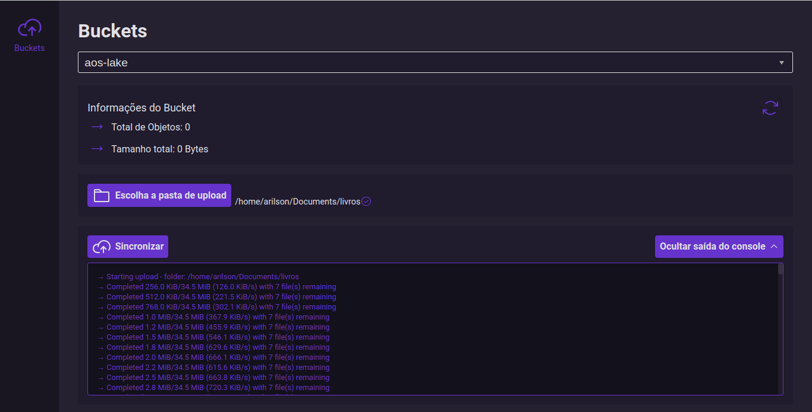

# S3 Sync Tool

This is an Electron/ReactJS desktop app that provides a UI for easily uploading S3 buckets. It primarily utilizes the AWS CLI for its core functionality.

This is a WIP, and as such is very limited in functionality, and may contain bugs. Do not use this to sync production s3 buckets.

<p align="center">
  
</p>

## Requirements
- You must have the [AWS CLI](https://aws.amazon.com/cli/) installed and configured.
- You must have at least one Amazon s3 bucket created.

## Setup

1. Install npm dependencies:
```
npm install
```

2. To run the app locally in development mode:
```
npm start
```
## Future Plans

- Add the ability to configure AWS credentials directly through the app, and switch users/roles.
- Add file browser for s3.
- Allow for files to be downloaded to s3.